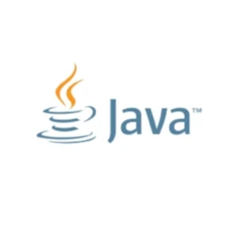
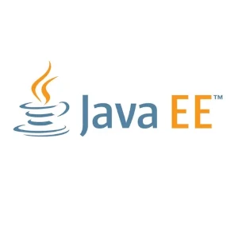
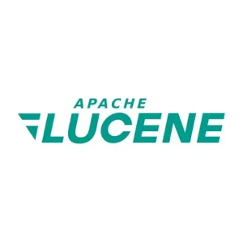
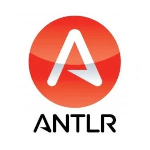
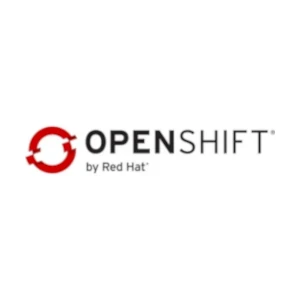

<section id="about">
    

        <article>
            <header class="major">
                <h2>Обо мне</h2>
            </header>
            

            Физик, математик, инженер-программист с опытом разработки ПО более 20 лет.
            За это время разработал ряд <a href="#projects" class="next scrolly">интересных решений</a> в различных областях: от научных исследований до коммерческого
            программирования c использованием широкого круга языков программирования от Assempler (x86) до C/С++ и Java.
            

        </article>
    

</section>
<section id="projects">
    

        <article>
            <header class="major">
                <h2>Проекты</h2>
            </header>
            

                <ul>
                    <li>Система потоковой обработки XML;</li>
                    <li>Интернет банк;</li>
                    <li>Система управления складами;</li>
                    <li>Разработка игровых серверов;</li>
                    <li>Платежная система;</li>
                    <li>Системное ПО для OC семейства Windows;</li>
                    <li>Реверс-инжиниринг и написание ПО для работы с научными приборами;</li>
                    <li>Системы для обработки научных данных.</li>
                </ul>
            

        </article>
    

</section>
<section id="services">
    

        <header class="major">
            <h2>Услуги</h2>
        </header>
        

            <h3>Разработка ПО</h3>
            
Разработка ПО. На текущий момент, работаю со следующим <a href="#keytechnologies" class="next scrolly">стеком</a> технологий.

            <ul class="actions">
                <li><a href="/development" class="button next scrolly">Подробнее...</a></li>
            </ul>
        

        

            <h3>Разработка/ревью архитектуры</h3>
            
Разработка системной архитектуры программного обеспечения — это фундаментальный этап, который определяет успех всего проекта. 

            <ul class="actions">
                <li><a href="/arhitecture" class="button next scrolly">Подробнее...</a></li>
            </ul>
        

        

            <h3>Формирование команды</h3>
            
Помощь в формировании сильной и сбалансированной команды.

            <ul class="actions">
                <li><a href="/hr" class="button next scrolly">Подробнее...</a></li>
            </ul>
        

    

</section>
<section id="keytechnologies">
    

        <article>
            <header class="major">
                <h2>Ключевые технологии</h2>
            </header>
            
Некоторые из основных технологий, которые я использую в проектах в настоящее время. Более полный список инструментария,
            с которым я когда либо работал, можно найти <a href="alltechnologies" class="next scrolly">здесь</a>

            

                    

                        
<a href="https://www.java.com" target="_blank">Java SE</a>

                        
<a href="https://jakarta.ee/" target="_blank">JAVA EE</a>

                        
<a href="https://scala-lang.org/" target="_blank">Scala</a>

                        
<a href="https://spring.io/" target="_blank">Spring</a>

                        
<a href="https://www.oracle.com/" target="_blank">Oracle</a>

                        
<a href="https://www.postgresql.org/" target="_blank">Postgres</a>

                        
<a href="https://hibernate.org/" target="_blank">Hibernate</a>

                        
<a href="https://kafka.apache.org/" target="_blank">Kafka</a>

                        
<a href="https://lucene.apache.org/" target="_blank">Lucene</a>

                        
<a href="https://www.antlr.org/" target="_blank">Antlr</a>

                        
<a href="https://junit.org" target="_blank">JUnit</a>

                        
<a href="https://developer.mozilla.org/ru/docs/Learn_web_development/Core/Scripting/What_is_JavaScript" target="_blank">JavaScript</a>

                        
<a href="https://www.groovy-lang.org/" target="_blank">Groove</a>

                        
<a href="https://git-scm.com/" target="_blank">Git</a>

                        
<a href="https://maven.apache.org/" target="_blank">Maven</a>

                        
<a href="https://gradle.org/" target="_blank">Gradle</a>

                        
<a href="https://checkstyle.org/" target="_blank">Checkstyle</a>

                        
<a href="https://www.sonarsource.com/products/sonarqube/" target="_blank">Sonarqube</a>

                        
<a href="https://www.docker.com/" target="_blank">Docker</a>

                        
<a href="https://www.jaspersoft.com/" target="_blank">Jasper Soft</a>

                        
<a href="https://www.bouncycastle.org/" target="_blank">Bouncy Castle</a>

                        
<a href="https://www.redhat.com/en/technologies/cloud-computing/openshift" target="_blank">OpenShift</a>

                    

            

        </article>
    

</section>
